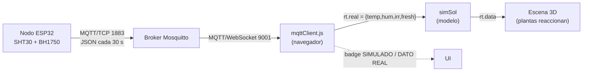

# Ingesta MQTT en SOL-TERRAZA (01)

Pipeline completo sensor → MQTT → modelo → visualización para el gemelo
SOL-TERRAZA. Con el broker apagado la app funciona igual (modo simulado); con el
broker y el nodo encendidos, el gemelo reacciona a la temperatura real y la UI lo
declara.

## Flujo



El ESP32 habla MQTT sobre TCP; el navegador solo puede hablar MQTT sobre
WebSocket. Ambos llegan al mismo Mosquitto, que escucha en los dos transportes.

## Tópico y payload

- Tópico: `solterraza/sensores` (configurable con `VITE_MQTT_TOPIC`).
- Payload que publica el nodo:

```json
{"temp":24.13,"hum":58.7,"lux":13400.0}
```

| Campo | Unidad | Origen | Notas |
|-------|--------|--------|-------|
| `temp` | °C | SHT30 | Canal mínimo: sin `temp` numérica el mensaje se descarta. |
| `hum`  | %  | SHT30 | Opcional. |
| `lux`  | lux | BH1750 | Opcional. El navegador lo convierte a W/m². |
| `irr`  | W/m² | — | Alternativa a `lux`: si el nodo ya envía W/m², se usa tal cual. |

El nodo **no** envía marca de tiempo (no tiene reloj de pared). El sello de tiempo
es la hora de recepción en el navegador; es la que alimenta el "hace X s" y el
timeout. Ver [parseReading](../src/lib/mqttParse.js) y [mqttClient](../src/lib/mqttClient.js).

### Conversión lux → W/m²

La eficacia luminosa de la luz de día global ronda **120 lux por W/m²**, así que
`irr ≈ lux / 120`. Es una aproximación (varía con el ángulo solar y la nubosidad),
suficiente para una lectura indicativa. La constante está en
[mqttParse.js](../src/lib/mqttParse.js) (`LUX_TO_WM2`). Para irradiancia precisa se
usaría un piranómetro; el BH1750 mide luz visible, no el espectro solar completo.

## Contrato de datos (no romper)

La ingesta respeta el contrato del proyecto:

1. `mqttClient.js` escribe la última lectura en un ref del navegador.
2. Cada tick (500 ms), `App.jsx` calcula la frescura (`ahora − recepción < timeout`)
   y coloca `rt.real = {temp, hum, irr, fresh}`.
3. `simSol` consume `rt.real` **solo si `fresh`**: sustituye sus canales medidos
   (temp, hum, irr) por el dato real. Todo lo aguas abajo (alerta térmica `aT`,
   severidad `sev`) reacciona al dato real, así que **las plantas de la escena
   cambian de color sin tocar la escena 3D**.
4. Los valores reales quedan en `rt.data.{temp,hum,irr}`, las mismas claves que ya
   leía la escena. Si el dato expira (timeout), `fresh=false` y el modelo vuelve a
   la serie sintética de forma transparente.

## Configuración (variables de entorno)

Copia `.env.example` a `.env.local`:

| Variable | Default | Qué hace |
|----------|---------|----------|
| `VITE_MQTT_URL` | (vacío) | URL del broker por WebSocket. **Vacío = ingesta deshabilitada.** |
| `VITE_MQTT_TOPIC` | `solterraza/sensores` | Tópico a suscribir. |
| `VITE_MQTT_TIMEOUT` | `15` | Segundos sin mensaje para volver a SIMULADO. |
| `VITE_MQTT_USER` / `VITE_MQTT_PASS` | (vacío) | Credenciales opcionales. |

Sin `VITE_MQTT_URL` el cliente es un no-op silencioso: la app corre en modo
simulado, sin errores ni ruido.

## Broker Mosquitto (dos listeners)

`mosquitto.conf`:

```conf
listener 1883
protocol mqtt

listener 9001
protocol websockets

# Demo local. En produccion: allow_anonymous false + password_file, y WSS/TLS.
allow_anonymous true
```

- El navegador se conecta a `ws://<host>:9001` (o `wss://` con TLS).
- El ESP32 se conecta a `<host>:1883`.

## Seguridad

- **Producción: WSS (TLS) obligatorio.** `ws://` va en claro; sirve solo para LAN
  o demo local. Con `wss://` el broker necesita certificado.
- **Autenticación:** desactiva `allow_anonymous` y usa `password_file`; pasa las
  credenciales por `VITE_MQTT_USER/PASS` y en el sketch.
- Las variables `VITE_*` quedan **incrustadas en el bundle** del navegador: no
  pongas ahí secretos de valor. Para credenciales reales, un broker con ACL por
  usuario y tópico de solo-lectura para el cliente web.

## Prueba de aceptación

1. **Broker apagado:** la app funciona normal, badge en `○ SIMULADO`.
2. **Broker + nodo (o `mosquitto_pub`) encendidos:**

```bash
mosquitto_pub -h <host> -t solterraza/sensores -m '{"temp":31.0,"hum":45,"lux":9000}'
```

La UI pasa a `● DATO REAL · hace 0 s`, la temperatura muestra 31 °C y, al superar
28 °C, se dispara la alerta térmica y las plantas viran a alerta. Al dejar de
publicar, tras `VITE_MQTT_TIMEOUT` segundos vuelve a `○ SIMULADO`.
