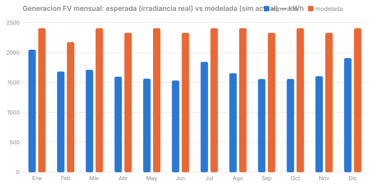

# Validación del gemelo 09 SOLAR-EDIFICIO

Estado: **validación de fuente climática (Fase A).** Cuantifica cuánto se desvía
la generación del modelo por usar irradiancia sintética en lugar de la real de
Bogotá. No valida todavía el modelo de panel contra medición de un edificio real
(ver límites al final).

Reproducible: `node scripts/validar-solar.mjs` (regenera la tabla, el JSON y la gráfica).

## Método

El simulador calcula la potencia FV con un modelo de panel fijo (12,5 kWp,
derrateo −0,35 %/°C, temperatura de celda tipo NOCT, 97,5 % de otras pérdidas;
ver [solarEd.js](../src/sim/solarEd.js) líneas 27-28). Ese modelo de panel no se
cuestiona en esta fase: se mantiene **idéntico** en las dos ramas de la comparación,
de modo que la única diferencia es la **fuente de irradiancia**.

- **Esperada:** el modelo de panel alimentado hora a hora con la irradiancia real
  (GHI del TMY). Es la generación que el mismo panel produciría bajo el clima real.
- **Modelada:** el simulador actual con su irradiancia sintética (sinusoide fijo
  `sin(π(h−6)/12)` + nubosidad aleatoria). Como el modelo no tiene fecha, su
  generación diaria es estadísticamente idéntica todo el año; la mensual es el
  diario medio multiplicado por los días del mes.

El error mensual es `modelada − esperada`, absoluto (kWh) y relativo (%).

## Fuente de datos

- **PVGIS v5.2**, producto TMY (Typical Meteorological Year), serie horaria de 8760 h.
- Ubicación: Bogotá, Aeropuerto El Dorado (aprox.) — 4,700 °N, −74,150, elevación 2547 m.
- Descargado: 2026-07-23. Archivo: [data/irradiancia-bogota-tmy.csv](../data/irradiancia-bogota-tmy.csv)
  (conserva el encabezado de procedencia y la tabla mes→año original de PVGIS).
- El TMF se compone de meses de años reales distintos (2006–2015), representativos
  del clima, no de un año concreto.

Cruce de cordura pendiente contra NASA POWER e IDEAM. `// TODO: contrastar GHI mensual con estación terrestre IDEAM.`

## Resultado

| Mes | GHI real (kWh/m²) | Esperada (kWh) | Modelada (kWh) | Error rel. |
|-----|------------------:|---------------:|---------------:|-----------:|
| Ene | 174,7 | 2048 | 2407 | +17,6 % |
| Feb | 143,9 | 1682 | 2174 | +29,2 % |
| Mar | 144,2 | 1711 | 2407 | +40,7 % |
| Abr | 134,1 | 1597 | 2329 | +45,9 % |
| May | 130,7 | 1564 | 2407 | **+53,9 %** |
| Jun | 128,6 | 1533 | 2329 | +51,9 % |
| Jul | 155,9 | 1844 | 2407 | +30,5 % |
| Ago | 139,5 | 1653 | 2407 | +45,6 % |
| Sep | 131,5 | 1558 | 2329 | +49,5 % |
| Oct | 130,8 | 1559 | 2407 | **+54,4 %** |
| Nov | 134,8 | 1605 | 2329 | +45,1 % |
| Dic | 161,3 | 1908 | 2407 | +26,2 % |
| **Año** | **1710** | **20 263** | **28 342** | **+39,9 %** |

## Hallazgo

**El modelo sobreestima la generación anual en +39,9 %, y el error no es constante:
va de +17,6 % en enero (temporada seca) a +54,4 % en octubre y +53,9 % en mayo
(las dos temporadas de lluvia de Bogotá).**

La causa es la nubosidad sintética. El modelo enciende nubes con probabilidad fija
(`R() < dt/60`) y las mantiene ~1–2 h reduciendo la irradiancia al 35 %; en promedio
eso deja un cielo demasiado despejado y, sobre todo, **igual los 365 días**. Bogotá
tiene un régimen bimodal (lluvias en abr–jun y sep–nov, veranillo seco en dic–feb y
jul–ago) que el modelo no puede ver porque no sabe qué mes es. Por eso el error se
dispara justo en los meses húmedos: ahí el modelo "ve" sol que en la realidad la
nubosidad convectiva bloquea.

La falta de estacionalidad se mide directamente:

- Estacionalidad real (mes máx/mín): **1,34×** (máx enero, mín junio).
- Estacionalidad del modelo: **1,11×**, y esa variación es solo por los días del mes.
- Variabilidad día a día del modelo: CV **7,3 %** — ruido de `rnd()`, no clima.

## Dónde el modelo deja de ser válido

- **Cualquier decisión estacional.** Dimensionar batería para el mes peor, estimar
  el rendimiento anual o la autonomía en temporada de lluvias: el modelo actual
  sobreestima la generación entre +40 % (anual) y +54 % (meses húmedos). No sirve
  para eso sin la corrección de la Fase B.
- **Esta validación aísla solo el error climático**, no el del modelo de panel. Los
  coeficientes del panel (12,5 kWp, −0,35 %/°C, NOCT) se asumen correctos en ambas
  ramas; su exactitud absoluta frente a la salida AC medida de un edificio real
  **no está verificada** por falta de datos de generación medidos.
  `// TODO: contrastar contra medición real de un edificio con FV en Bogotá.`
- **La irradiancia se toma como plano-de-arreglo horizontal** (GHI directo, sin
  transposición). Cerca del ecuador el plano horizontal es casi óptimo, así que es
  una aproximación razonable; un arreglo inclinado con transposición de Perez
  correría los valores absolutos. Esa transposición es profundidad opcional, fuera
  del camino crítico de esta validación.
- **Solo se valida energía mensual.** La dinámica intradía (térmica interior, SoC,
  climatización) no se contrasta aquí.

## Fase B (implementada): irradiancia real conmutable

El simulador ya puede alimentarse con la climatología real de Bogotá mediante la
bandera `rt.cmds.tmyReal`, expuesta en la UI como el toggle **"Irradiancia:
sintética / TMY real (PVGIS)"**. En modo real, `irr` y la temperatura exterior
salen de un perfil horario embebido; en sintético, el camino original queda
intacto (mismo orden de números aleatorios: los tests de determinismo siguen
pasando). El contrato `rt.data` no cambia de forma (solo se añade el campo aditivo
`mes`).

- Dato embebido: [src/sim/data/tmyBogota.js](../src/sim/data/tmyBogota.js), perfil
  horario medio por mes (12×24), hora local UTC−5, derivado del CSV real.
  Regenerable con `node scripts/gen-tmy-embed.mjs`.
- Cobertura de test: `solarEd.test.js` verifica que en modo real la generación anual
  es menor que la sintética y que aparece estacionalidad (máx/mín > 1,15×), mientras
  la sintética se mantiene plana (< 1,05×).

**Límite del perfil embebido:** es la **media horaria por mes**, no la serie de 8760 h.
Reproduce la forma diurna y la estacionalidad (que es lo que el modelo no tenía),
pero pierde la variabilidad día a día y los días extremos; además, promediar la
irradiancia antes de aplicar el modelo de panel (levemente no lineal por el derrateo
térmico) introduce un sesgo pequeño frente a integrar hora a hora. Para análisis que
dependan de eventos extremos, usar la serie completa del CSV con `scripts/validar-solar.mjs`.

Con la irradiancia real, el error residual deja de ser climático: pasa a ser el error
del modelo de panel, que es lo que habría que cuantificar después contra medición real
de un edificio.
